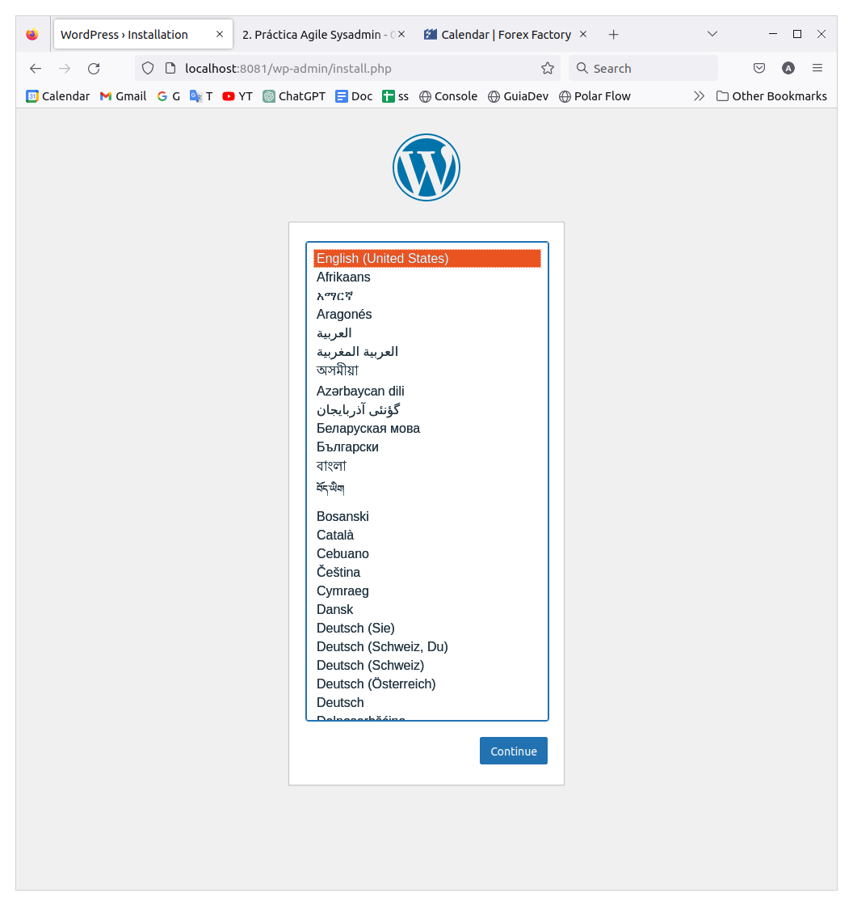

# Práctica SysAdmin

Autor: Aimar Lauzirika

## El proyecto

Este proyecto permite levantar dos máquinas virtuales con ,por una parte, wordpress, mariadb y filebeat, y por otra parte, el stack elk (elasticsearch, logstash y kibana). Todo configurado y listo para su uso mediante `vagrant`.

## Requisitos

Para poder levantar este proyecto necesitaremos tener instalados `vagrant` y `virtualbox`. Las versiones con las que se garantizan el correcto funcionamiento son: vagrant 2.3.4 y 7.0.4.

## Puesta en marcha

Para ejecutar los ficheros vagrant y montar las máquinas automáticamente con las instalaciones y configuraciones necesarias, con la terminal ubicada en el directorio donde se ubica el fichero Vagrantfile se ejecutará el comando **vagrant up**.

El comando vagrant up ejecutará vagrant y interpretará el fichero Vagrantfile para saber que debe montar.

## El fichero Vagrantfile

En el fichero Vagrant he especificado que quiero que se monten dos máquinas, las dos con el systema operativo Ubuntu 22.04 y ambos con un disco extra de 1GB.

La primera máquina, que tendrá wordpress, tendrá las siguientes características definidas en el fichero Vagrantfile:

- 1 CPU
- 1GB de RAM
- Red privada con la ip: 192.168.100.2
- Su puerto 80 corresponderá con el puerto 8081 del host
- Ejecutará los scripts de bash del fichero provision_wp.sh para las instalaciones y configuraciones

La segunda máquina se utilizará para almacenar y monitorizar los logs de la primera máquina y para ello contará con el stack ELK de elastic y tendrá las siguientes características:

- 1 CPU
- 4GB de RAM
- Red privada con la ip: 192.168.100.3
- Su puerto 80 corresponderá con el puerto 8082 del host
- Ejecutará los scripts de bash del fichero provision_elk.sh para las instalaciones y configuraciones

## Scrips de provisión

Cada máquina ejecuta fichero de scripts para realizar todas las instalaciones y configuraciones que necesite.

### Máquina Wordpress

#### Punto de montaje
Lo primero que realiza es montar en /var/lib/mysql un file system con el disco extra, para almacenar ahí las bases de datos de MariaDB que utilizará wordpress.

#### Repositorio elastic
Después configura el repositorio y la clave de elastic para poder descargar e instalar filebeat más adelante.

#### Instalar Nginx, MariaDB y PHP
Ahora instala Nginx, MariaDB y php-fpm, ya que wordpress lo requerirá para que funcione.

#### Configurar Nginx y MariaDB
Para configurar Nginx se crea un fichero en /etc/nginx/sites-available/ con las configuraciones, que en este caso son básicamente utilizar el puerto 80 y utilizar como directorio raiz /var/www/wordpress. Además de crear un enlace simbólico del fichero de configuración en /etc/nginx/sites-enabled/, eliminando el enlace por defecto.

Y respecto a MariaDB ejecutar los comando para securizarlo.

#### Instalar y configurar Wordpress
Para instalarlo de tiene que descargar y descomprimir el en directorio /var/www/wordpress. Y para configurar solo se requiere cambiar el usuario y grupo del directorio anterior a www-data y realizar unos cambios en el fichero wp-config.php.

#### Instalar y configurar Filebeat
Para instalar Filebeat se requiere el repositorio de elastic, por lo que primero se configura el repositorio y después se instala con **apt install filebeat**.

Para configurar filebeat habilitaremos los módulos de nginx y system y tenemos que modificar el fichero /etc/filebeat/filebeat.yml para especificar que los inputs van ha ser logs y las úbicaciones de estas, y las salidas las dirigiremos a la ip de la segunda máquina al puerto: 5044.

### Máquina ELK

#### Punto de montaje
Al igual que la máquina de wordpress, está máquina tendrá un file system pero en /var/lib/elasticsearch para la base de datos de elasticsearch. Y este directorio tendrá como usuario y grupo a elasticsearch.

#### Repositorio elastic
El stack ELK requerirá del repositorio de elastic para las instalaciones.

#### Instalar Nginx y Java
Simplemente utilizar **apt install nginx** y **apt install default-jre**.

#### Instalar y configurar Logstash
Instalar con **apt install logstash** y añadir los ficheros .conf para configurar los inputs, filtros y los outputs. Los inputs recibirlos por el puesto 5044, y los outputs a elasticsearch (localhost:9200), creando un index.

#### Instalar y configurar Elasticsearch
Se instalará elasticsearch mediante el comando **apt install -y elasticsearch** y a continuación se realizarán las configuraciones necesarias.

#### Instalar y configurar Kibana
Instalaremos kibana con **apt install kibana** y lo configuraremos modificando el fichero /etc/nginx/sites-available/default. Y añadiremos usuario y contraseña para poder acceder. 

El nombre de usuario por defecto es `kibanaadmin`, que está definida en la línea 87 del fichero 'provision_elk.sh'. Y la contraseña se define en el fichero 'config/elk/.kibana'.

## Funcionamiento
Si ya tenemos las máquinas corriendo, podremos acceder tanto a Wordpress como a Kibana.

### Wordpress

Si abrimos el navegador y escribimos localhost:8081 accederemos a la página de configuración de Wordpress para después hacer login y entrar en la página de administrador.

Una vez aquí ya tenemos wordpress listo.

### ELK
En el caso de kibana escribiremos `localhost:8082` en el navegador.

> ¡Atención! Si accedemos a localhost:8082 seguido de arrancar la máquina puede que nos aparezca este resultado.

Esto se debe a que a Kibana no le ha dado tiempo a ponerse en marcha. Espera un minuto y recarga la página.

La primera vez que se accede tenemos que autenticarnos con el usuario y contraseña especificado en la configuración de Kibana.

Y con esto accedemos a Kibana.

Hacemos click en Explore on my own.

Para acceder a los índices vamos a Stack Management que se sitúa en el menú de la parte izquierda abajo.

Y desde aquí podemos acceder a Index Management desde el menú de la izquierda.

Y aquí se muestra el index filebeat-x.x...

## Revisión

Este proyecto es la corrección de la práctica entregada en enero, el cuál no funcionaba como se pretendía. Esta vez ya funciona adecuadamente, y lo que ha hecho que ahora funcione ha sido cambiar las versiones de filebeat, elasticsearch, logstash y kibana del 8.x al 7.x como se me recomendó.

También he cambiado el comando utilizado para crear la partición (fdisk) para utilizar `parted` siguiendo las recomendaciones.